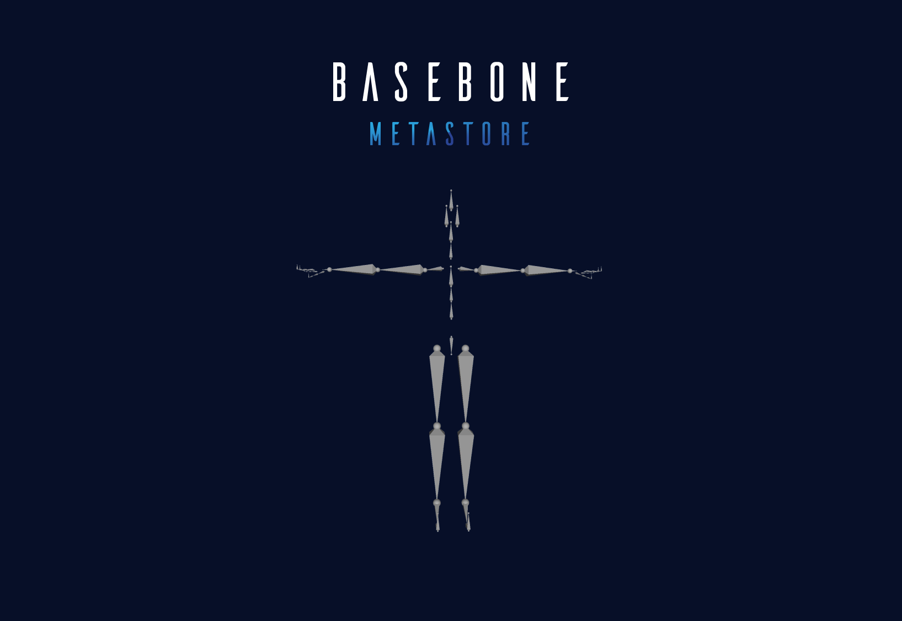

import Callout from 'nextra-theme-docs/callout'

## Creating Characters

We provide you with base 3d mesh on top of which you will build your character.
You can use any 3d software you want to alter the 3d mesh.
We recommend Blender, but you can use any other software you are familiar with.

<Callout emoji="⇩">
  Download the base mesh from <a href="/base-mesh.zip">here</a>
</Callout>

 

We provide cross-game compatability by restricting the use of certain bone structure. These bone structure help in animating the character in the game.
Deforming the base bone structure will result in odd animations and non fitting skins.
Therefore, we advise against fully deforming the base mesh.

Not adhering to this will result in your character being removed from the marketplace.

 

## Upload your character

Once you have created your character, you can upload it to the <a href="https://www.meta-store.in/create/item">Metastore Marketplace</a>.
Upload your character as a .glb file and fill in the details.
You can also upload a preview image of your character.

 

## Service charges

We charge a service fee of 1% on all sales for NFTs using STORE coin as a payment method and a 2% service fee
for NFTs using a payment method other than STORE coin.

This is to cover the cost of maintaining and further developing the Metastore.

 

## Why no royalties ?

We prefer that the NFTs purchased via Metastore be spent in-game rather than being resold.
So instead of more resales, we anticipate increased NFT creation.
The lack of royalties will motivate creators to create more NFTs.

Additionally, this will give gamers complete ownership and control over their NFTs.
