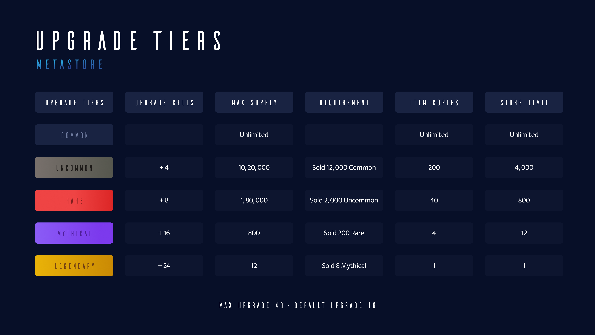
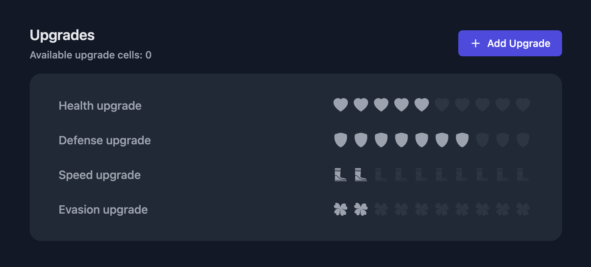

# Upgrade Cells

Upgrade Cells are a type of item that you can use to upgrade your weapons and skins to a higher rarity, which increases their stats.

To gamify the platform for the creators and to ensure quality items are being created constantly,
we have come up with the upgrade tiers. Higher rarity upgrade cells are locked at each tiers
and can only be unlocked when certain requirements are met.

 

The requirement is to sell, (not create) a certain amount of items.
This assures quality items are being created in the marketplace and along with the max supply limits in the different upgrade tiers, item creations are promoted.

E.g., Only 12 legendary items can ever exist for a category, and only the first 12 stores which clear all the requirements can create it.

Upon unlocking each tier releases a certain amount of upgrade cells to use.
These upgrade cells can be used to upgrade the item parameters like health, power, speed, etc.

16 upgrade cells are provided as default for every item. Maximum is 40

 

