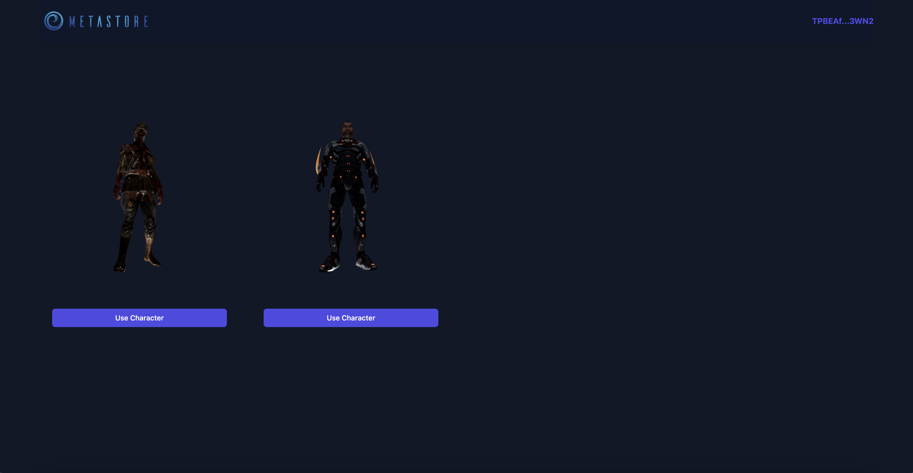

## The Metastore Widget

The Metastore Widget enables users to connect with their Metastore account and choose their game item to play with.

<br />



## How to integrate the Metastore Widget

The Metastore Widget is a web iframe that can be accessed directly from your website.
The users game items will be automatically loaded and displayed in the widget.

### Here is a simple example of how to integrate the Metastore Widget:

Call the `https://meta-store.in/widget` URL in an iframe.

```js
<iframe src="https://meta-store.in/widget"></iframe>
```

Then listen to the `message` event to get the user's game item and it's attributes

```js
window.addEventListener('message', (event) => {
  const data = JSON.parse(event.data)
  if (data.source === 'metastore') {
    const item = data.itemUrl
    const itemAttributes = JSON.parse(data.attributes)
  }
})
```

You will receive the following data:

```js
{
  source: 'metastore',
  itemUrl: 'https://meta-store.in/item/0x1234567890',
  attributes: '{
    "health": 0,
    "attack": 0,
    "defence": 0,
    "speed": 0,
    "evasion": 0,

   }'
}
```
