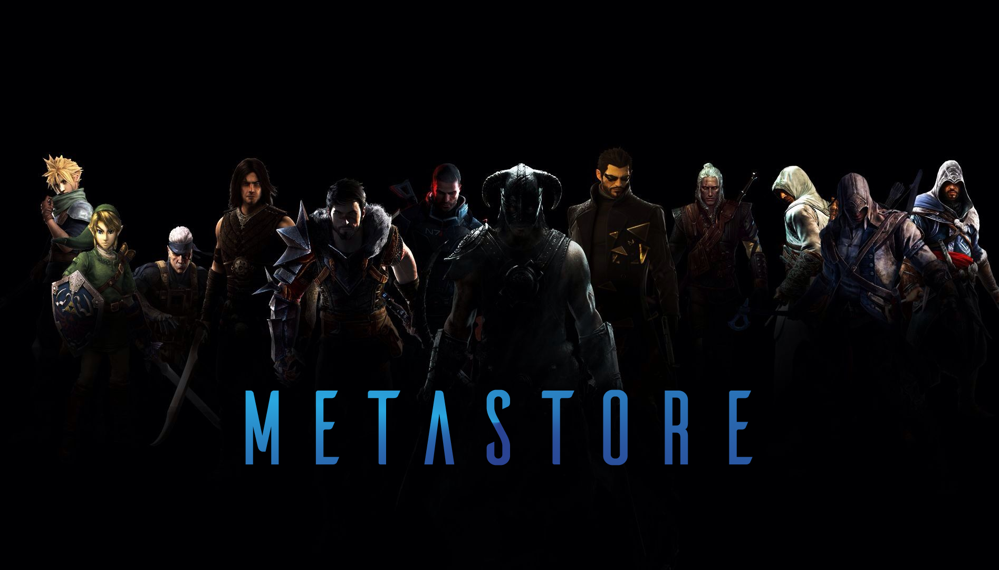

import Bleed from 'nextra-theme-docs/bleed'

<Bleed>

# Metastore

Welcome to The Metastore official documentation.

 

## What is Metastore?

Metastore is a decentralized, cross-game items marketplace where players have complete ownership of their in-game items. It allows users to create and trade game assets like skins, avatars, and more.
Metastore is built on top of the <a href="https://tron.network/" target="_blank">Tron network.</a>

</Bleed>
