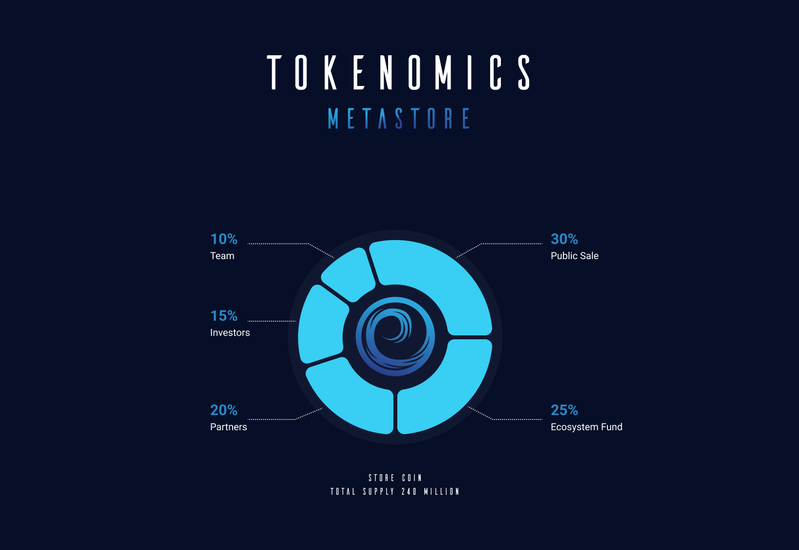

## Introduction

Ever wonder what the term "metaverse" means? The word is a combination of "universe" with the prefix "meta," which means beyond.
In other words, “metaverse” roughly translates to something like “the next universe.”
It's similar to creating a virtual version of the real world, or even better, connecting many parallel virtual realities.

Many businesses are investing in the metaverse, including Facebook, Microsoft, and Sony.
The metaverse is a new frontier for the gaming industry, and it's expected to be worth $1 trillion by 2030.

Sooner when each company has its own metaverse, we will be able to connect to each other's worlds and interact with each other.
Social networking will enter a new age, and all industries will advance significantly as a result.

But a problem arises from connecting different worlds.
In each world, the users will have a varied appearance, and the money will be unique. There are no universally usable game objects or a single currency.
We wish to offer that to users. A cross-game / cross-verse game item and currency.

 

## Problem

Many games and Metaverse applications do not yet enable players to exchange and use in-game items between games.
This is prevalent since each game has its own unique properties. Overall, we still lack a platform for creating cross-game objects,
which is a significant barrier to integrating and maintaining large-scale distributed virtual worlds.

The nicest thing about cross-game items is that they will give you a distinct identity across all games and apps, exactly as in the real world.
The games of today, however, lack this. You'll have a varied appearance in every virtual world. This may not seem crucial in games,
but it is critical for Metaverse as this is where you will go shopping, watch movies, go to school, and do many other things.

 

## Solution

We are developing a framework that will allow users to create and trade cross-game items and
we are also planning to make our native currency (STORE) as a cross-game currency.
There are many benefits to having cross-game / cross-verse items and currency. Such as

- enable Players to establish a distinctive identity in the Metaverse.
- possibilities for cross-game play-to-earn models utilizing STORE coins as a currency.
- Developers can concentrate on building their games and apps without worrying about the game items and currency.
- Players don't have to buy characters and skins for each game they play. They can use the same character and skins in every game they play.

 

## STORE

STORE is a TRC-20 utility token built on the Tron blockchain that serves as the basis for transactions within The Metastore ecosystem.

Check out our token distribution strategy down below.

 

 

- The total supply of STORE coins is capped at 240 million tokens. It serves as both a utility token and a governance token.

- The STORE coin will be primarily used for payments within the Metastore ecosystem.

- The STORE coin will eventually be integrated with our partner games, enabling play-to-earn functionality.

- The Metastore team will also be using the STORE coin to incentivize the community to participate in the development of the Metastore platform.

- The adaptability and flexibility of the STORE coin are really shaping up to be the ideal game currency. Think of a universal currency that is accepted in all games and Metaverse apps.

That's what the STORE coin is all about.
